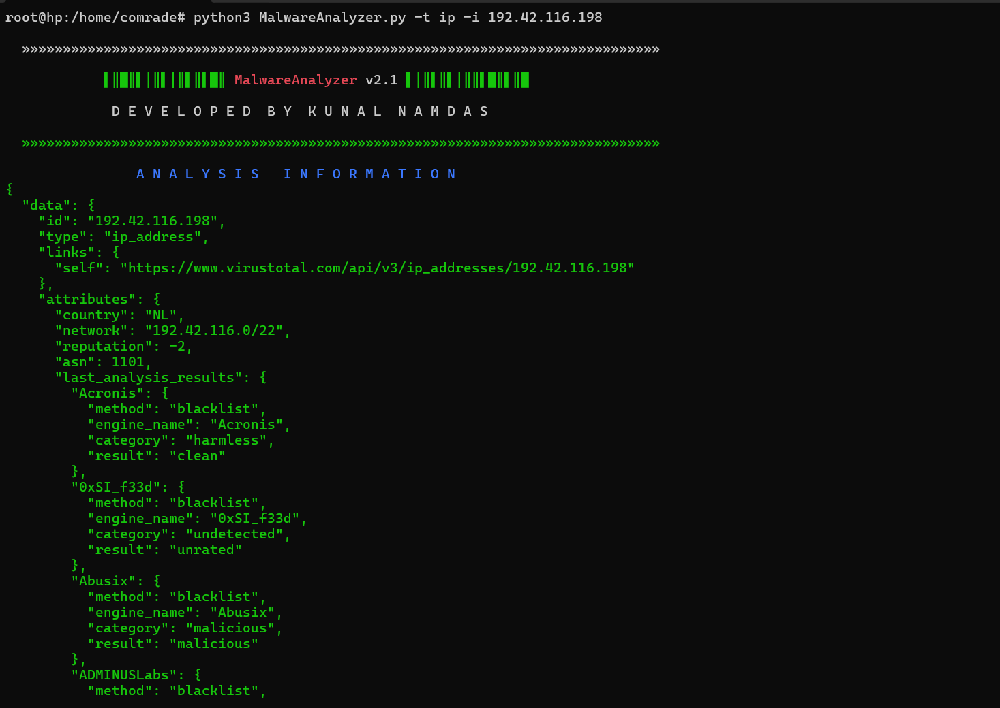
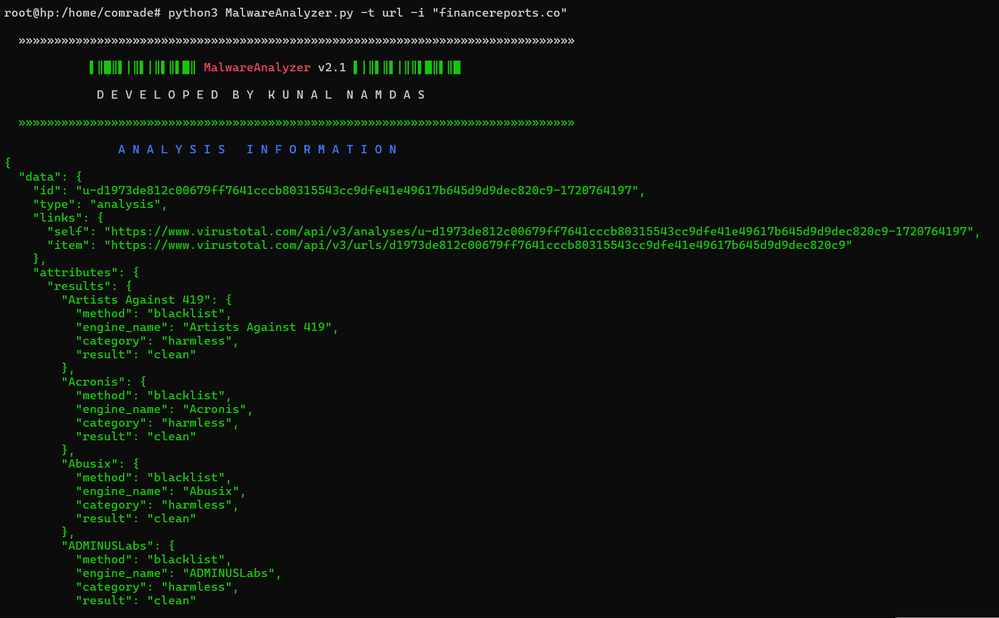
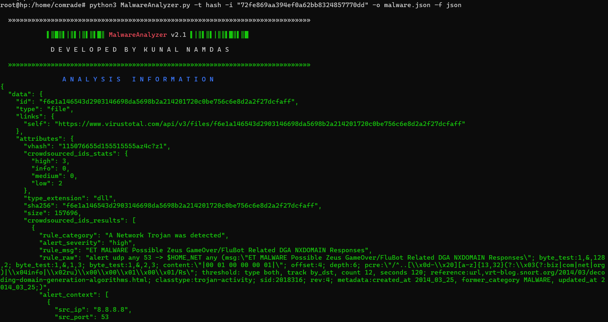

# MalwareAnalyzer

MalwareAnalyzer is a powerful tool designed for analyzing files, URLs, domains, and IP addresses using the VirusTotal API. It helps in detecting and analyzing malware, providing detailed insights about potential threats.

## DEVELOPER

#### Kunal Namdas

### MalwareAnalyzer image




## Features

- Analyze files for malware
- Scan URLs for malicious content
- Retrieve information about domains
- Get details about IP addresses
- Save analysis results to a file in JSON or text format
- Verbose mode for detailed output

## Installation

1. Clone the repository:

   ```bash
   git clone https://github.com/kunalnamdas/MalwareAnalyzer.git
   cd MalwareAnalyzer
pip install -r requirements.txt

## Usage

Command Line Arguments

-t, --type: Type of input: file, url, hash, domain, or ip (required)

-i, --input: File path, URL, hash value, domain name, or IP address (required)

-o, --output: Path to save the output

-f, --format: Format of the output file (json or text, default is json)

--verbose: Print verbose output

## Examples

#### Analyze a file 

- python MalwareAnalyzer.py -t file -i /path/to/file

#### Scan a URL

- python MalwareAnalyzer.py -t url -i https://example.com

#### Retrieve information about a hash  

- python MalwareAnalyzer.py -t hash -i 1234567890abcdef1234567890abcdef

#### Get details about a domain

- python MalwareAnalyzer.py -t domain -i example.com

#### Analyze an IP address 

- python MalwareAnalyzer.py -t ip -i 8.8.8.8

#### Save output to a file 

- python MalwareAnalyzer.py -t file -i /path/to/file -o output.json -f json

#### Verbose mode 

- python MalwareAnalyzer.py -t file -i /path/to/file --verbose


## Thank You for Using MalwareAnalyzer!

Thank you for choosing MalwareAnalyzer to automate your malware analysis tasks. We hope this tool helps you efficiently find and analyze potential threats. Enjoy using MalwareAnalyzer! If you encounter any issues or have any suggestions, feel free to open an issue on GitHub!

